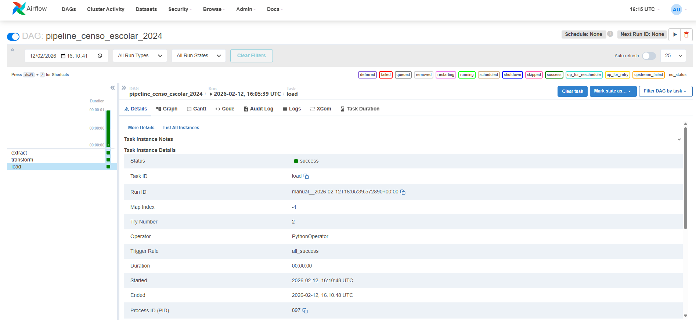

# Pipeline ETL: Microdados Censo Escolar 2024 📊

## 🎯 Objetivo
Este projeto automatiza a extração e o processamento de grandes volumes de dados do INEP, transformando-os em métricas educacionais estratégicas através de uma arquitetura moderna de engenharia de dados.

## 🏗️ Arquitetura e Tecnologias
* **Linguagem Principal:** Python (Pandas) para limpeza e transformação.
* **Orquestração:** Apache Airflow gerindo o workflow de dados.
* **Conteinerização:** Docker e Docker Compose para isolamento total do ambiente.
* **Armazenamento:** PostgreSQL como Data Warehouse.
* **Visualização:** Metabase para dashboards estratégicos.
  

## 🖼️ Visualização do Pipeline e Dashboards
Abaixo, a evidência do pipeline orquestrado no Airflow e os resultados analíticos processados:

### Orquestração (Airflow)

*Visualização do workflow automatizado garantindo o fluxo entre Extração, Transformação e Carga (ETL).*

### Dashboards Estratégicos (Metabase)

*Métricas de infraestrutura, saneamento e situação de funcionamento das escolas.*

## 📈 Métricas Processadas
O pipeline calcula automaticamente **16 indicadores-chave**, com destaque para:
* **Saneamento e Saúde:** Percentual de escolas sem esgoto e acesso a água potável.
* **Infraestrutura:** Quantidade total de escolas e situação de funcionamento (ativa/paralisada).
* **Gestão:** Distribuição de escolas por dependência administrativa (Pública vs. Privada).

## 📁 Sobre os Dados
Devido ao limite de tamanho do GitHub, o arquivo bruto `censo_escolar_2024.csv` não está incluído neste repositório. 
Para rodar o pipeline:
1. Baixe os microdados no portal oficial do INEP.
2. Coloque o arquivo `.csv` dentro da pasta `/data` antes de iniciar os containers.

## 🚀 Como Executar
1. Certifique-se de ter o Docker instalado e o modo **SVM ativo** na BIOS (para usuários AMD/Aorus).
2. Clone este repositório.
3. Execute `docker-compose up -d`.
4. Acesse o Airflow em `localhost:8080` e o Metabase em `localhost:3000`.
